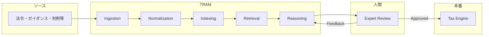

# GetSphere TRAM ワークフロー参照

記事 [Building TRAM | The World's First Tax Review and Assessment Model](https://www.getsphere.com/blog/building-tram) に基づき、税務コンプライアンス領域のワークフローを抽出。SchemaOps の「マーケットプレイス・コンプライアンス」設計の参考とする。

---

## 全体像

TRAM は「非構造化の法・行政資料」を「バージョン管理された機械可読ルール」に変換し、確定論的な税計算エンジンに渡すパイプライン。人間の税務研究者がやるステップを同じ順序で、スケールで自動化している。

---

## ステップ 1: データ収集・監視（Ingestion）

| 項目 | 内容 |
|------|------|
| **目的** | 各管轄の「支配的権威」となる一次ソースを継続的に取得・監視する。 |
| **ツール** | WARP（Web Automation Reimagined Purposefully）— 自社開発の Web 自動化。 |
| **対象ソース** | 一次法令、行政規則・ガイダンス、通達・通知、判例、私的 letter ruling。可能な限り政府・税務当局の公式サイトから取得。 |
| **運用** | 各ソースの公開 URL を登録し、定期クロールをスケジュール。更新や新規文書を検知したら再取り込みパイプラインを起動。 |
| **監視の効果** | 法改正・新ガイダンス・判例が出たら、該当する既存の determination の見直しをトリガーし、専門家に「要更新」をフラグ。事後対応ではなく事前に更新できる。 |

**SchemaOps への対応イメージ**: マーケットプレイス各社のポリシー・規約・ガイドラインの公式 URL を登録し、WARP に相当するクローラーで定期取得・変更検知する。

---

## ステップ 2: データ正規化・前処理（Data normalization and preparation）

| 項目 | 内容 |
|------|------|
| **入力** | Web ページ、PDF、スプレッドシート、Word など多様なフォーマット。 |
| **抽出** | コンテンツを抽出しつつ、**元の構造をできるだけ保持**（例: HTML はタグを残す、構造化 PDF はフラット化しない）。 |
| **分割** | 文書が大きいため、**意味的に意味のある単位**でチャンクに分割。固定 N 語で切る単純分割は使わない。 |
| **分割の方法** | (1) **ルールベース**: 見出し・番号・構造マーカーからセクション境界を推定。パターンが合う文書では高精度・高速。(2) **LLM ベース**: ルールに合わない文書は LLM が文書ごとの分割ルールを生成し、それをコードで適用。 |
| **メタデータ付与** | 各チャンクに付与: 親文書、管轄（jurisdiction）、施行日、権威の種類、コンテンツ由来のタグ。**文書階層**（親セクション→ルート文書）をメタデータで保持。 |
| **多言語** | 非英語文書は英語版を生成して保存し、社内専門家のレビューを統一。 |

**SchemaOps への対応イメージ**: マーケットプレイス規約を「条・項」やポリシーセクション単位で分割し、プラットフォーム名・施行日・ポリシー種別などのメタデータを付与。構造がバラバラな文書は LLM で文書固有の分割ルールを生成。

---

## ステップ 3: インデックス構築（Indexing）

| 項目 | 内容 |
|------|------|
| **方式** | **ハイブリッド**: 同一チャンクを **dense** と **sparse** の 2 系統でインデックス。 |
| **Dense** | チャンクの「意味」をベクトル化。クエリと表現が違っても意味が近いものを検索できる。 |
| **Sparse** | 用語・フレーズ・引用をそのまま重視。法令文の正確な語句・定義・引用に強い。 |
| **メタデータ** | 各チャンクのメタデータをインデックスに紐づけ、**検索時のフィルタ**（例: 管轄）に利用。 |
| **設計判断** | dense / sparse の組み合わせが、どちらか単体より一貫して性能が良いと判断。 |

**SchemaOps への対応イメージ**: 規約・ポリシーのチャンクを dense + sparse でインデックスし、プラットフォーム・カテゴリ・施行日などでフィルタ可能にする。

---

## ステップ 4: 検索（Retrieval）

| 項目 | 内容 |
|------|------|
| **入力** | タスク記述＋対象製品（または商品タイプ）＋管轄。タスクに応じて「特定の分類での determination 用」または「 taxonomy 作成・更新用」のクエリを生成。 |
| **フィルタ** | まず **管轄（jurisdiction）** でインデックスを絞り、その中だけで検索。 |
| **クエリ** | タスクから **sparse 用** と **dense 用** の検索クエリを生成。 |
| **取得** | dense / sparse の両方から候補セクションを取得。 |
| **マージ** | 両方の結果に含まれるセクションは **ブースト**。統合リストを作成。 |
| **リファインメントループ** | 以下を **目標コンテキストサイズに達するまで繰り返し**: (1) 現在のセクションをタスクの文脈で分析し **再ランク**、(2) 最も関連度の低いものを **除外**、(3) 残ったトップのセクションについて **同一文書内の隣接セクション** を追加してコンテキストを拡張。 |
| **出力** | メタデータと文書階層付きの「精選されたセクション集合」を、次の Reasoning ステップの **権威ソース** として渡す。 |

**SchemaOps への対応イメージ**: 「この商品カテゴリ × このマーケットプレイス」のようなタスクで、該当プラットフォームの規約インデックスをフィルタし、ハイブリッド検索＋再ランク＋隣接拡張で、根拠となる条項・ポリシーを揃える。

---

## ステップ 5: 税務推論・Determination（Reasoning）

| 項目 | 内容 |
|------|------|
| **入力** | タスクの構造化記述（目的・対象製品・管轄）、管轄の税の課し方・微妙な点・既存の Sphere の取扱い、Retrieval で得た権威セット（階層・施行日・権威タイプ）、および **過去の専門家レビューから得たシグナル**（同じ製品・管轄での修正・却下理由）。 |
| **モデル** | OpenAI の **RFT（Reinforcement Fine-Tuning）** 推論モデルを、自社の専門家フィードバックでファインチューニング。複数ステップの法・税務推論と、複数権威の比較衡量に最適化。 |
| **Determination タスク** | 取得した権威を読み、製品への適用を解釈し、**構造化された提案** を出力: 課税可否、適用税率、減免、ソーシング・按分ルール。 |
| **Taxonomy タスク** | 税務取扱いに効く **製品の特徴** を特定。製品クラス・属性を提案し、対象製品をその構造に割り当て。 |
| **出力** | いずれも **推論サマリ**（結論に至る理由）と **根拠となる権威への引用** を付与。専門家が一箇所でレビューできる **機械可読な提案**（分類 or determination ＋ 理由 ＋ 根拠）。 |

**SchemaOps への対応イメージ**: 「この商品はこのマーケットプレイスでリスト可能か／どの制限・表示義務が付くか」を、取得した規約・ポリシーと過去の修正履歴に基づき、構造化提案＋理由＋引用の形で出力する。

---

## ステップ 6: 人間の専門家承認・フィードバック（Review）

| 項目 | 内容 |
|------|------|
| **原則** | TRAM の提案は **すべて** 社内税務チームの承認を得るまで本番税エンジンに入れない。専門家の「判断とフィードバック」に集中してもらうための UI・ツールに投資。 |
| **レビューダッシュボード** | 保留中の determination セット・taxonomy 提案のキュー、および **既存 determination や税率が新規・更新ガイダンスの影響を受ける可能性** のアラートを表示。 |
| **1 件あたりの操作** | 提案・推論サマリ・根拠権威を並べて表示。専門家は **(1) そのまま承認 (2) 一部修正（引用・推論の修正など） (3) 却下して自ら determination を記述** のいずれか。 |
| **修正・却下時** | 「何が誤り／不足していたか」の **短い説明** を必須入力。説明はタスク文脈・取得権威・**最終承認結果** と一緒に保存。 |
| **フィードバックの利用** | 上記データで retrieval と reasoning の戦略を更新し、ファインチューニング用の教師データも更新。**同じようなタスクで同じミスを繰り返さず、承認済み判断を積み上げる**。 |
| **Eval** | 専門家が「内部 eval セット」に determination をマーク。モデルや retrieval を変更するたびにこのセットで自動実行し、**リグレッション検出** とリリース可否の判断、および精度・進捗の計測に利用。 |
| **本番反映** | 承認された determination / taxonomy は **確定論的税エンジン** に投入。**施行日** を明示的に扱い、数ヶ月先の法改正に合わせた新取扱いを「今日承認し、施行日に有効化」するスケジューリングが可能。 |
| **効率化** | 関連 determination の一括操作、管轄・製品カテゴリでのフィルタ・検索、現行 vs 提案の並列比較をサポート。 |

**SchemaOps への対応イメージ**: コンプライアンス担当者が「リスト可否・制限・表示義務」の提案をキューで承認・修正・却下し、修正理由を必ず記録。その理由で retrieval / 推論モデルを改善し、eval セットでリグレッションを監視。承認済みルールのみが本番の「マーケットプレイス・コンプライアンス・エンジン」に反映される。

---

## ステップ 7: 本番エンジンへの反映と監視

| 項目 | 内容 |
|------|------|
| **反映** | 承認された内容が **バージョン付きルール** となり、本番の **確定論的税エンジン** にプロモート。 |
| **監視** | Ingestion で監視しているソースが変更されると、その権威に基づく determination の見直しがトリガーされ、専門家にフラグ。**常に権威の最新状態と同期** する設計。 |
| **改善ループ** | 専門家の修正・却下理由が TRAM にフィードバックされ、**将来の retrieval と推論** が改善する自己改善サイクル。 |

**SchemaOps への対応イメージ**: 承認されたルールだけがバージョン管理され、マーケットプレイス判定エンジンに反映。規約の変更検知で「要レビュー」を出し、修正理由でモデル・検索を継続改善する。

---

## 成果指標（参考）

- **Accuracy**: 専門家が一切手を入れずに承認した determination の割合。現在 **90% 超**（記事執筆時点）。
- **Expert time**: determination 1 件あたりの中央値のレビュー時間。**10 秒未満** まで短縮。
- 初期（オフザ shelf モデル＋標準 RAG）は accuracy 65% 未満、中央値約 2 分/件。そこから accuracy 約 +40pt、レビュー時間約 -92% と記載。

---

## SchemaOps へのマッピング（要約）

| TRAM（税務） | SchemaOps（マーケットプレイス） |
|--------------|----------------------------------|
| 法令・ガイダンス・判例 | 各 MP の規約・ポリシー・ガイドライン |
| 管轄（jurisdiction） | マーケットプレイス（または地域×MP） |
| 製品 × 管轄の税務 determination | 商品カテゴリ × MP のリスト可否・制限・表示義務 |
| 製品 taxonomy（税務上の特徴） | 商品属性・カテゴリとコンプライアンス要件の対応 |
| 税エンジン | マーケットプレイス・コンプライアンス判定エンジン |

---

## SchemaOps 設計への適用

このステップバイステップの流れをそのまま「規約・ポリシー → 正規化・分割・メタデータ → ハイブリッドインデックス → タスク指向検索 → 推論（提案＋理由＋引用）→ 専門家レビュー＋フィードバック → 本番ルール・継続監視」として SchemaOps に当てはめると、GetSphere のワークフローを marketplace compliance 向けに再現しやすい。
